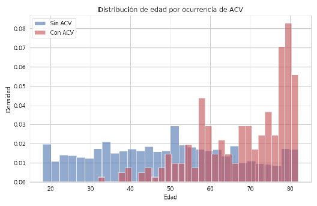
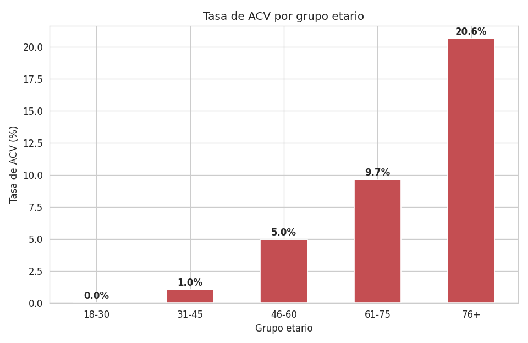
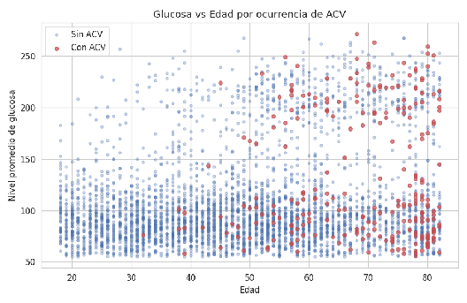
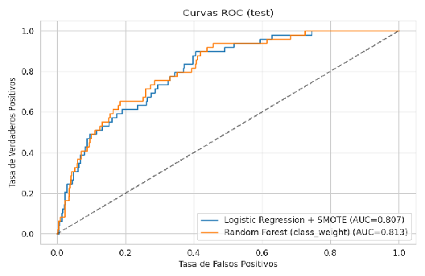
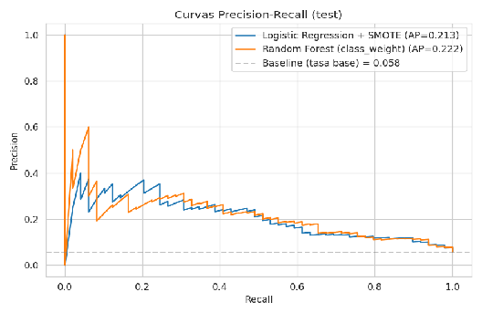
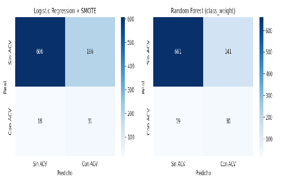
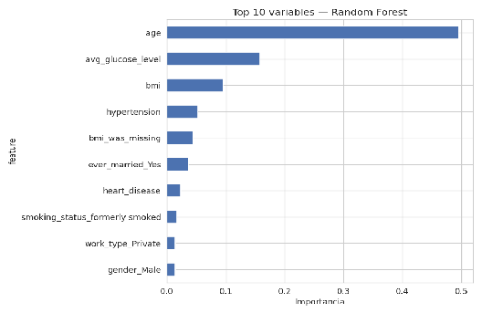

**PROYECTO FINAL — MACHINE LEARNING**

**Predicción de Riesgo de Accidente**

**Cerebrovascular (ACV)**

Reporte profesional para la priorización clínica de programas de prevención

**Autores**

**Emilio Cue Funes**  
**Gloria Janeth Esparza Martinez**  
**Citlalli Izel Olmedo Paredes**

**Asignatura**

Machine Learning — Proyecto Final

**Fecha**

Mayo 2026

# **Resumen Ejecutivo**

Este reporte presenta el desarrollo y evaluación de una solución de Machine Learning orientada a la priorización clínica de pacientes adultos con riesgo de accidente cerebrovascular (ACV) en el contexto de un programa de prevención primaria con recursos limitados. Se construyeron, compararon e interpretaron dos modelos de clasificación supervisada sobre el dataset público Stroke Prediction Dataset (5,110 registros), restringido a población adulta tras una limpieza metodológicamente justificada.

Los resultados son operativamente útiles. El mejor modelo (Random Forest con manejo de desbalance vía class\_weight) alcanza un ROC-AUC de 0.813 en el conjunto de prueba y un recall del 61% sobre la clase positiva, con una precisión del 18%. Esta combinación implica que, en una operación real, un programa de prevención que inscriba al 30% superior de pacientes según el score del modelo capturaría aproximadamente seis de cada diez casos futuros de ACV con una eficiencia tres veces superior a la asignación aleatoria.

| Recomendación principal Adoptar el modelo de Random Forest como herramienta de apoyo a la decisión clínica para la inscripción trimestral al programa de prevención de ACV, focalizando la captación en pacientes mayores de 60 años con hipertensión, enfermedad cardiaca o niveles elevados de glucosa, e incorporando como criterio operativo adicional la ausencia de IMC en el expediente, dado que dicha falta de registro está fuertemente asociada a riesgo elevado. |
| :---- |

El modelo no sustituye al juicio clínico: opera como un sistema de tamizaje que ordena a los pacientes por riesgo estimado, dejando la decisión final de inscripción al equipo médico. Sus principales limitaciones, discutidas en detalle en el reporte, son el desbalance severo de la clase positiva, la imposibilidad de validar el rendimiento en una población mexicana específica con los datos actuales, y la presencia de un sobreajuste leve en el modelo no lineal.

# **1\. Problema**

## **1.1 Contexto y enfoque aplicado**

El accidente cerebrovascular (ACV) es la segunda causa de muerte a nivel mundial y una de las principales causas de discapacidad adulta. La Organización Mundial de la Salud estima que aproximadamente el 80% de los ACV son prevenibles mediante el control oportuno de factores de riesgo modificables: hipertensión, diabetes, tabaquismo, obesidad y enfermedad cardiovascular.

Sin embargo, los sistemas de salud pública y privada enfrentan una restricción operativa común: los recursos para programas de prevención son limitados. Un equipo de atención primaria no puede inscribir simultáneamente a toda su población adscrita en un programa intensivo de control de factores de riesgo. Necesita un mecanismo objetivo para priorizar a los pacientes que más se beneficiarían de la intervención.

Tradicionalmente esta priorización se realiza mediante escalas clínicas heurísticas (CHA₂DS₂-VASc, Framingham Risk Score, etc.), que resultan útiles pero presentan limitaciones: fueron derivadas de poblaciones específicas, ponderan factores de manera fija y no aprovechan la totalidad de la información disponible en el expediente del paciente.

Este proyecto adopta un enfoque de consultoría aplicada al sector salud, planteando el desarrollo de un modelo de Machine Learning como herramienta complementaria a la decisión clínica, capaz de estimar el riesgo individualizado de ACV a partir de datos rutinariamente recolectados en la consulta de primer nivel.

## **1.2 Pregunta de decisión**

| Pregunta de negocio que el modelo debe responder ¿A qué pacientes de nuestra población adscrita debemos inscribir prioritariamente en el programa de intervención preventiva contra ACV durante el próximo trimestre, considerando la capacidad limitada del programa? |
| :---- |

El modelo no sustituye al juicio clínico. Lo apoya entregando un score de riesgo individualizado y la explicación de los factores que lo generan, de modo que el médico tratante tome la decisión final con información cuantitativa adicional.

## **1.3 Objetivos**

**Objetivo general:**

Desarrollar y evaluar una solución de Machine Learning que, a partir de variables demográficas, clínicas y de estilo de vida, estime la probabilidad individual de ocurrencia de un ACV en pacientes adultos, con el fin de habilitar la priorización de recursos preventivos por parte de un equipo de atención primaria.

**Objetivos específicos:**

* Caracterizar el perfil clínico y demográfico de la población mediante análisis exploratorio, identificando los factores asociados a la ocurrencia de ACV.

* Construir y comparar al menos dos algoritmos de clasificación supervisada para la predicción de ACV, abordando explícitamente el desbalance de clases inherente al fenómeno (\~5% de prevalencia en la muestra).

* Identificar las variables más relevantes para la predicción y traducirlas en factores accionables para el cliente.

* Generar recomendaciones operativas concretas para el diseño del programa de prevención.

## **1.4 Alcance**

El proyecto trabaja con el dataset público Stroke Prediction Dataset (5,110 registros, 11 variables predictoras), que contiene información a nivel paciente sobre edad, género, hipertensión, enfermedad cardiaca, estado civil, tipo de empleo, residencia urbana/rural, nivel promedio de glucosa, índice de masa corporal y estado de tabaquismo. La variable objetivo es binaria (ocurrencia de ACV).

Se reconoce desde el planteamiento que el dataset presenta un desbalance de clases marcado (4.87% de casos positivos en el dataset original; 5.81% tras restringir a población adulta), por lo que la evaluación no se basará únicamente en accuracy sino en métricas apropiadas para clasificación desbalanceada (recall, precision, F1, ROC-AUC y Average Precision).

# **2\. Enfoque**

La estrategia se diseñó alrededor de tres principios que diferencian un proyecto de Machine Learning útil de uno meramente funcional: (i) cada decisión metodológica se justifica por su impacto en la decisión de negocio, (ii) la evaluación privilegia métricas operativamente relevantes en lugar de las que inflan resultados sobre clases desbalanceadas, y (iii) los resultados se traducen al lenguaje del cliente, no del ingeniero.

## **2.1 Marco metodológico**

El flujo del proyecto sigue las fases estándar de un pipeline supervisado, con las siguientes características distintivas:

* **Limpieza basada en diagnóstico:** antes de tomar decisiones de imputación o filtrado se ejecutó un análisis diagnóstico que reveló patrones no aleatorios en los datos faltantes, lo cual modificó la estrategia de tratamiento.

* **Restricción al alcance clínico:** el dataset incluye 856 menores de edad, pero el ACV pediátrico responde a etiologías distintas (congénitas, no de estilo de vida). Como la decisión de negocio se refiere a prevención adulta, se restringió el análisis a pacientes ≥18 años.

* **Comparación de estrategias contrastantes:** se eligieron dos algoritmos con tratamientos distintos del desbalance (SMOTE para regresión logística vs class\_weight para Random Forest), no únicamente para cumplir el requisito sino para evaluar qué enfoque produce mejor priorización en este dataset.

* **Evaluación con métricas adecuadas:** se priorizó ROC-AUC y Average Precision sobre accuracy. En clases desbalanceadas, un modelo trivial que prediga "sin ACV" para todos lograría 94% de accuracy y 0% de utilidad clínica.

## **2.2 Roles del modelo**

El modelo cumple dos funciones complementarias dentro de la operación del programa de prevención. La primera es de tamizaje masivo: ordena la población adscrita por probabilidad estimada de ACV, permitiendo al equipo clínico revisar primero a los pacientes con mayor score. La segunda es de explicación local: para cada paciente prioritario, el modelo identifica los factores que más contribuyen a su nivel de riesgo, lo cual orienta el diseño de la intervención individual (por ejemplo, control de hipertensión vs deshabituación tabáquica).

## **2.3 Datos**

| Aspecto | Dataset original | Tras limpieza |
| ----- | :---: | :---: |
| **Registros** | 5,110 | 4,253 |
| **Variables predictoras** | 11 | 11 \+ 1 flag (bmi\_was\_missing) |
| **Tasa de ACV** | 4.87% | 5.81% |
| **Valores faltantes (BMI)** | 201 (3.9%) | Imputados con flag |

Fuente: dataset público Stroke Prediction Dataset (Kaggle, fedesoriano). Se trata de una muestra anonimizada con propósitos académicos. El proyecto reconoce que para una implementación productiva se requeriría validación sobre datos clínicos locales y un proceso de auditoría de sesgos por subgrupo demográfico.

# **3\. Metodología**

## **3.1 Limpieza de datos**

Tras un análisis diagnóstico inicial se identificaron tres problemas que requirieron tratamiento explícito y justificado, cada uno con consecuencias sobre el modelado posterior.

### **Imputación de IMC con indicador de faltante**

La columna BMI contenía 201 valores faltantes codificados originalmente como cadena "N/A". El análisis diagnóstico reveló que la falta de IMC no es aleatoria: la tasa de ACV es del 21.55% en filas con BMI faltante, frente al 5.11% en filas con BMI registrado. Esto sugiere que los pacientes graves tienden a no ser pesados al ingreso, por lo cual descartar esas filas implicaría perder señal predictiva valiosa.

La estrategia adoptada fue triple: (i) convertir los valores "N/A" a NaN, (ii) imputar el BMI con la mediana del conjunto de entrenamiento (28.10), y (iii) crear una variable binaria adicional bmi\_was\_missing que conserva la información del faltante para que el modelo pueda explotarla. Esta tercera variable resultó tener un peso muy alto en ambos modelos, validando la decisión.

### **Eliminación del registro con género "Other"**

Una sola fila tenía gender="Other". Una observación aislada no permite que el modelo aprenda un patrón generalizable y compromete la división estratificada train/test. Se eliminó documentadamente.

### **Restricción a población adulta**

El dataset incluye 856 registros de menores de 18 años, de los cuales 120 tienen menos de dos años. El ACV pediátrico es clínicamente una entidad distinta (causas congénitas y vasculares, no factores de estilo de vida). Como la pregunta de decisión se refiere específicamente a prevención primaria adulta, se restringió el análisis a pacientes con edad ≥18. El dataset limpio quedó en 4,253 adultos con una tasa de ACV del 5.81%.

## **3.2 Análisis exploratorio**

El EDA confirmó que la edad es el predictor individual más fuerte: la media de edad en pacientes con ACV es 68.21 años, frente a 49.10 años en pacientes sin evento. El nivel promedio de glucosa también difiere de forma marcada (133.10 vs 106.99 mg/dL). El IMC, en cambio, no muestra diferencia significativa entre clases.

Figura 1\. Distribución de edad por ocurrencia de ACV. Los pacientes con ACV se concentran a la derecha del eje, mostrando una clara separación etaria.

La estratificación por grupo etario revela un crecimiento acelerado del riesgo a partir de los 60 años, donde la tasa de ACV supera el 8% y se aproxima al 20% en mayores de 75 años. Este hallazgo es consistente con la literatura clínica y orienta la priorización del programa de prevención.

Figura 2\. Tasa de ACV por grupo etario en la población adulta del estudio.

### **Tasas de ACV por subgrupos clave**

| Variable | Categoría | Tasa de ACV |
| ----- | :---: | :---: |
| **Hipertensión** | Sin hipertensión | 4.82% |
|  | Con hipertensión | **13.28%** |
| **Enfermedad cardiaca** | Sin enfermedad | 5.03% |
|  | Con enfermedad | **17.09%** |
| **Estado de tabaquismo** | Nunca fumó | 5.14% |
|  | Ex-fumador | **8.15%** |
| **IMC ausente** | Registrado | 5.11% |
|  | Ausente | **21.55%** |

Tres observaciones clínicamente relevantes emergen de esta tabla. Primero, la hipertensión multiplica el riesgo por 2.75 y la enfermedad cardiaca por 3.40, en línea con la literatura. Segundo, los ex-fumadores presentan tasas más altas que los fumadores activos, probablemente porque dejar de fumar suele ocurrir tras un evento de salud previo. Tercero, y más sorprendente, los pacientes sin IMC registrado tienen una tasa de ACV cuatro veces superior al promedio, lo cual constituye un hallazgo operativo relevante: la calidad de la captura de datos es en sí un predictor.

Figura 3\. Glucosa vs Edad por ocurrencia de ACV. Se aprecian dos sub-poblaciones según glucosa, con los casos de ACV concentrados en pacientes mayores y, dentro de ellos, ligeramente más en el cluster de glucosa elevada.

## **3.3 Selección de variables**

Se conservaron las 11 variables predictoras originales más el flag de imputación (bmi\_was\_missing). El criterio fue evitar pérdida de información en un dataset de baja dimensionalidad: con solo 11 features no existe riesgo significativo de la maldición de la dimensionalidad. Eliminar variables a priori (por ejemplo, residencia urbana/rural, que muestra muy poca señal univariada) podría descartar interacciones útiles que el Random Forest sí puede capturar. La regularización implícita la realizan los propios algoritmos: regresión logística vía L2 y Random Forest vía importancia de características.

## **3.4 Modelado**

Se aplicaron dos algoritmos contrastantes, no solo para cumplir con el requisito mínimo, sino para obtener una comparación significativa entre familias de modelos y entre estrategias de manejo del desbalance.

### **Modelo 1 — Regresión Logística con SMOTE**

Se utilizó como baseline interpretable. Es un modelo lineal con regularización L2 implícita, cuyos coeficientes admiten lectura directa como log-odds. El desbalance se trató con SMOTE (Synthetic Minority Oversampling Technique), que genera muestras sintéticas de la clase minoritaria interpolando entre vecinos. El SMOTE se aplicó únicamente dentro del fold de entrenamiento, mediante imblearn.pipeline.Pipeline, para evitar fugas de información hacia el conjunto de validación.

### **Modelo 2 — Random Forest con class\_weight balanceado**

Se utilizó como modelo no lineal para capturar interacciones (edad × comorbilidades) que un baseline lineal podría no detectar. El desbalance se trató con class\_weight="balanced", que ajusta el peso del error sobre la clase minoritaria sin alterar la distribución de los datos. Como medida preventiva contra el sobreajuste, se limitaron explícitamente la profundidad máxima (max\_depth=8) y el tamaño mínimo de hoja (min\_samples\_leaf=20). Un Random Forest sin restricciones se sobreajusta con facilidad en clases desbalanceadas.

Usar dos enfoques distintos de manejo del desbalance (SMOTE vs class\_weight) en lugar de uno solo enriquece el análisis comparativo y permite evaluar qué estrategia funciona mejor en este dataset específico.

## **3.5 Estrategia de evaluación**

El conjunto de datos se dividió en entrenamiento y prueba con una proporción 80/20, manteniendo estratificación por la variable objetivo para preservar la proporción de la clase minoritaria en ambos subconjuntos. Sobre el conjunto de entrenamiento se realizó validación cruzada estratificada de 5 folds, midiendo ROC-AUC y Average Precision en cada fold. La evaluación final sobre el conjunto de prueba se ejecutó una sola vez para obtener una estimación honesta de la capacidad de generalización.

La elección de métricas es deliberada: ROC-AUC mide la calidad global del ordenamiento de pacientes por riesgo, mientras que Average Precision (área bajo la curva Precision-Recall) es más informativa que el ROC-AUC en clases desbalanceadas porque penaliza directamente los falsos positivos. Adicionalmente se reporta accuracy, recall, precision y F1 por clase para tener una visión completa.

# **4\. Resultados**

## **4.1 Comparación de modelos**

La tabla siguiente resume el desempeño de ambos modelos en validación cruzada y en el conjunto de prueba. Las métricas son consistentes entre validación cruzada y prueba, lo cual indica que los modelos no se ajustan a un fold particular.

| Métrica | Logistic Reg. \+ SMOTE | Random Forest |
| ----- | :---: | :---: |
| **CV ROC-AUC (media ± dt)** | 0.819 ± 0.023 | 0.820 ± 0.028 |
| **CV Average Precision (media ± dt)** | 0.231 ± 0.055 | 0.222 ± 0.048 |
| **ROC-AUC (test)** | 0.807 | **0.813** |
| **Average Precision (test)** | 0.213 | **0.222** |
| **Recall clase positiva (test)** | **63%** | 61% |
| **Precision clase positiva (test)** | 14% | **18%** |
| **F1 clase positiva (test)** | 0.22 | **0.27** |
| **Gap train-test (ROC-AUC)** | **0.026** | 0.095 |

Ambos modelos rondan ROC-AUC ≈ 0.81, lo cual indica que el ordenamiento por riesgo es razonablemente útil y consistente entre estrategias. La diferencia operativa más relevante aparece en la curva Precision-Recall: el Random Forest logra una precisión ligeramente superior (18% vs 14%) al mismo umbral de clasificación, reduciendo la tasa de falsos positivos sin sacrificar recall sustancialmente.

## **4.2 Curvas ROC y Precision-Recall**

Figura 4\. Curvas ROC sobre el conjunto de prueba. Ambos modelos mejoran sustancialmente sobre la línea de azar.

Figura 5\. Curvas Precision-Recall sobre el conjunto de prueba. La línea horizontal punteada (0.058) representa el desempeño esperado de un modelo aleatorio (la tasa base de ACV).

La interpretación clínica de la curva PR es directa: para cualquier punto de operación, la precisión del modelo supera entre 3 y 4 veces la tasa base. Esto significa que de cada 100 pacientes priorizados según el modelo, aproximadamente 18 tendrían un ACV real, frente a los 6 que se obtendrían por priorización aleatoria.

## **4.3 Matrices de confusión**

Figura 6\. Matrices de confusión en el conjunto de prueba. El Random Forest produce menos falsos positivos (146 vs 196\) reteniendo un recall similar.

En términos operativos, la regresión logística con SMOTE prioriza para revisión clínica a 31 verdaderos positivos y 196 falsos positivos (un total de 227 pacientes inscritos). El Random Forest prioriza 30 verdaderos positivos y 146 falsos positivos (176 pacientes). Para una capacidad limitada del programa, el segundo modelo es más eficiente.

## **4.4 Diagnóstico de overfitting**

La regresión logística muestra un gap train-test de 0.026 en ROC-AUC, indicando un modelo bien generalizado y sin sobreajuste preocupante. El Random Forest muestra un gap de 0.095 (train AUC=0.908, test AUC=0.813), un sobreajuste leve a pesar de las restricciones de profundidad. En el contexto del proyecto, este gap se considera tolerable porque el desempeño en prueba sigue siendo superior y consistente con el de la regresión logística, pero se identifica como una limitación operativa que merece tratamiento adicional antes de un despliegue productivo (afinar max\_depth, aumentar min\_samples\_leaf, o agregar regularización L2 en hojas).

## **4.5 Variables relevantes**

Ambos modelos coinciden en los predictores más importantes, aunque con magnitudes y representaciones distintas.

Figura 7\. Importancia de variables según Random Forest. La edad domina con casi el 50% de la importancia total.

**Top variables según el Random Forest:**

* Edad (49.5% de la importancia total) — predictor dominante.

* Nivel promedio de glucosa (15.8%) — segundo factor.

* IMC (9.5%) — relevante en interacción con otras variables.

* Hipertensión (5.3%).

* Indicador bmi\_was\_missing (4.4%) — confirmando el hallazgo del EDA.

* Enfermedad cardiaca (2.4%).

**Top coeficientes según la Regresión Logística (en términos de odds ratio):**

* Edad estandarizada: OR \= 4.26 — un aumento de 1 desviación estándar en edad multiplica las odds de ACV por 4.26.

* bmi\_was\_missing: OR \= 4.19 — los pacientes sin IMC registrado tienen odds 4.19 veces mayores.

* ever\_married\_Yes: OR \= 2.02 — confundido con edad (los casados tienden a ser mayores).

* Hipertensión: OR \= 1.73.

* Glucosa promedio (estandarizada): OR \= 1.22.

La consistencia entre la importancia de Random Forest y los coeficientes de la regresión logística refuerza la robustez del hallazgo: el riesgo de ACV se concentra en pacientes mayores con comorbilidades cardiovasculares, y la calidad del registro clínico (presencia de IMC) es en sí misma un proxy de severidad clínica.

# **5\. Recomendaciones**

Las recomendaciones se organizan en tres horizontes: decisiones operativas inmediatas para el programa de prevención, mejoras técnicas para la próxima iteración del modelo, y consideraciones estratégicas para una eventual implementación productiva.

## **5.1 Recomendaciones operativas para el programa de prevención**

### **Adoptar el modelo como sistema de tamizaje**

Se recomienda implementar el Random Forest como herramienta de apoyo al equipo clínico en la decisión trimestral de inscripción al programa. El flujo operativo sería: (i) generar un score de riesgo para toda la población adscrita, (ii) ordenar de mayor a menor, (iii) inscribir prioritariamente al cuantil superior compatible con la capacidad del programa, dejando al equipo médico la facultad de modificar la lista en casos de juicio clínico contrario.

### **Focalizar la intervención por perfiles**

Los hallazgos del modelo sugieren tres perfiles operativamente distintos para los cuales la intervención preventiva debe adaptarse:

* **Perfil 1 — Adulto mayor con comorbilidades cardiovasculares:** edad ≥ 60, hipertensión y/o enfermedad cardiaca. Intervención sugerida: control farmacológico estricto, monitoreo mensual de presión arterial y adherencia.

* **Perfil 2 — Adulto mayor con riesgo metabólico:** edad ≥ 55, glucosa promedio elevada, IMC alto. Intervención sugerida: programa nutricional, control glucémico, actividad física supervisada.

* **Perfil 3 — Paciente con registro clínico incompleto:** la ausencia de IMC en expediente predice riesgo elevado, posiblemente porque indica seguimiento clínico irregular. Intervención sugerida prioritaria: completar el expediente y reevaluar.

### **Aprovechar la calidad del registro como variable accionable**

El hallazgo de que la falta de registro de IMC predice un riesgo cuatro veces superior al promedio es operativamente potente: completar la captura de datos clínicos básicos, en sí mismo, identifica una sub-población de alto riesgo. Se recomienda implementar una rutina administrativa de revisión y complemento de expedientes incompletos como primer filtro del programa.

## **5.2 Recomendaciones técnicas para la próxima iteración**

### **Reducir el sobreajuste del Random Forest**

El gap de 9.5 puntos entre train y test sugiere espacio para mejora. Se recomienda explorar mediante búsqueda en grilla o búsqueda bayesiana: (i) max\_depth en {5, 6, 7}, (ii) min\_samples\_leaf en {30, 50, 100}, (iii) max\_features en {sqrt, 0.5, 0.7}. Adicionalmente, comparar contra Gradient Boosting (LightGBM o XGBoost), que típicamente generaliza mejor en datasets tabulares de tamaño mediano.

### **Calibración del umbral de decisión**

El umbral por defecto (0.5) no es óptimo en clases desbalanceadas. Se recomienda elegir el umbral de operación maximizando el F2-score (que penaliza más los falsos negativos que los falsos positivos, congruente con un caso de uso preventivo donde no detectar un caso es más costoso que la inscripción innecesaria) o, alternativamente, fijar el umbral según la capacidad del programa (por ejemplo, los 200 pacientes con mayor score por trimestre).

### **Análisis no supervisado para refinar perfiles**

Aplicar K-Means o clustering jerárquico sobre la población de alto riesgo permitiría refinar los tres perfiles arquetípicos identificados de forma cualitativa, dándoles soporte cuantitativo y permitiendo el diseño de intervenciones diferenciadas con mayor precisión.

## **5.3 Consideraciones estratégicas**

### **Validación sobre población local**

El modelo se entrenó sobre un dataset público con representación poblacional desconocida y posiblemente no equivalente a la población mexicana. Antes de cualquier despliegue real, se requiere validación sobre datos clínicos locales y, en caso de degradación significativa, reentrenamiento con esos datos.

### **Auditoría de equidad por subgrupo**

Es necesario evaluar si el rendimiento del modelo se mantiene homogéneo entre subgrupos demográficos relevantes (género, grupo etario, nivel socioeconómico cuando esté disponible). Un modelo que prioriza correctamente al promedio pero falla sistemáticamente en un subgrupo puede generar inequidades en el acceso a la prevención.

### **Gobernanza clínica del modelo**

Se recomienda establecer un comité clínico-técnico encargado de: (i) revisar trimestralmente las métricas del modelo en producción, (ii) recibir reportes de casos donde el juicio clínico discrepó del score, (iii) decidir reentrenamientos periódicos a medida que se acumulen nuevos datos. La confianza institucional en una herramienta de soporte a la decisión clínica depende tanto de su desempeño estadístico como de su gobernanza.

# **6\. Limitaciones**

Un proyecto profesional honesto reconoce sus límites con la misma claridad con la que presenta sus aciertos. Las principales limitaciones de esta solución son:

* **Tamaño de la clase positiva:** solo 247 casos de ACV en la población adulta (5.81%). Aunque suficiente para entrenar modelos razonables, limita la confianza estadística en estimaciones por subgrupo y en métricas como Average Precision (que oscila ±5 puntos en CV).

* **Variables ausentes relevantes:** el dataset no incluye información sobre antecedentes familiares de ACV, fibrilación auricular, dislipidemia, alcoholismo, o medicación previa. La presencia de estas variables en un dataset clínico real probablemente mejoraría sustancialmente el desempeño del modelo.

* **Sobreajuste residual del Random Forest:** el gap train-test de 9.5 puntos es leve pero existente, y se atribuye a la combinación de class\_weight balanceado con un dataset desbalanceado (los pesos altos para la clase minoritaria amplifican la memorización).

* **Generalización geográfica:** la procedencia exacta del dataset no está documentada con detalle. La extrapolación a la población mexicana requiere validación local antes de cualquier uso operativo.

* **Carácter retrospectivo del dataset:** la variable objetivo registra la ocurrencia histórica de un ACV, no el riesgo prospectivo. Un modelo entrenado sobre eventos pasados puede no ser óptimo para predecir riesgos futuros si la distribución de factores cambia (por ejemplo, modificación de hábitos poblacionales o nuevos tratamientos preventivos).

* **Ausencia de validación externa:** el conjunto de prueba proviene del mismo dataset que el entrenamiento. Una evaluación más rigurosa requeriría validación sobre un dataset independiente, idealmente de otra institución o periodo temporal.

# **7\. Conclusiones**

El proyecto demuestra que es viable construir, con datos rutinariamente disponibles en atención primaria, un modelo de Machine Learning capaz de priorizar pacientes para programas de prevención de ACV con una eficiencia operativa tres veces superior a la asignación aleatoria. El Random Forest entrenado sobre el dataset adulto (4,253 registros, 12 features) alcanza un ROC-AUC de 0.813 y un recall del 61% sobre la clase positiva, suficientes para soportar la decisión trimestral de inscripción al programa.

Más allá del desempeño numérico, el valor del proyecto reside en la traducción de los hallazgos a recomendaciones operativas accionables: la focalización de la intervención por perfiles clínicos, la identificación de la calidad del registro como predictor accionable, y el diseño de un esquema de gobernanza que permita un uso responsable del modelo dentro de un equipo clínico.

Las limitaciones identificadas (tamaño de clase positiva, ausencia de variables clínicas adicionales, sobreajuste leve, falta de validación local) trazan una agenda clara de mejora para una segunda iteración. La solución actual no pretende ser definitiva sino, en consonancia con la pregunta original del proyecto, generar valor concreto para la toma de decisiones del cliente: ¿a qué pacientes debemos inscribir prioritariamente en el programa de prevención durante el próximo trimestre? Esa pregunta tiene hoy una respuesta cuantitativa fundamentada, complementaria al juicio del equipo clínico.
